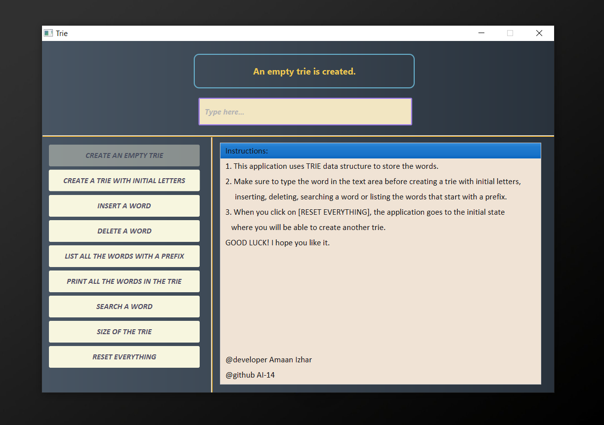
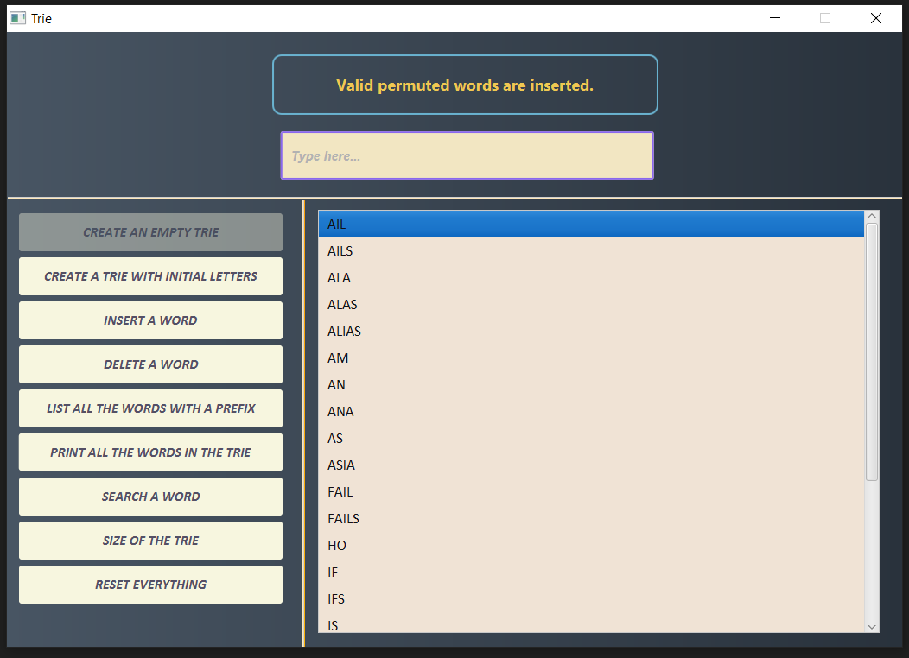

# Trie Data Structure
  Course Project: ICS 202/192 - Data Structures and Algorithms

## Description
   Design a Trie data structure. For more details, see *LabProject202-192.docx*.

## Screenshots Of The Application



## Installation And Usage
1. Installation
   - Make sure you have Javafx and Java (8) on your machine.
   - Download/clone this repository and create a proper project folder where you will extract this repo's contents.
  
2. Usage
   - Run ````Main.java```` (src\application).
